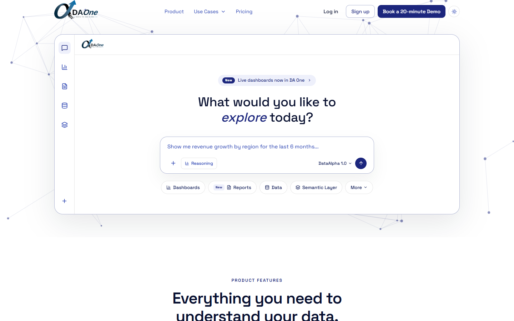

# DA One — Landing Page

Marketing site and product pages for **DA One** by DataAlpha — an AI data analyst that turns Excel, PDF, and enterprise data into instant answers and reports. Built with React 19, Vite, and Tailwind CSS 4, with a small Express/SQLite backend for auth and the AI chat demo.



## Features

- Marketing homepage — hero, product features, pricing, demo, and final CTA sections
- Dedicated `/product` page for the enterprise DA One platform
- Full light/dark theme support with a persisted toggle
- Auth flow (signup/login) backed by a local Express + SQLite server
- `/dashboard` — a working AI chat demo: upload Excel/PDF files and ask questions, answered via an LLM backend
- Responsive across mobile, tablet, and desktop
- Scroll-reveal animations (Framer Motion), respecting `prefers-reduced-motion`

## Tech Stack

| Layer | Stack |
|---|---|
| Frontend | React 19, Vite 7, TypeScript, Tailwind CSS 4 |
| Backend | Express 5, better-sqlite3, JWT auth, bcrypt |
| AI chat | NVIDIA-hosted LLM API (chat + file analysis) |
| Icons / motion | lucide-react, Framer Motion |

## Getting Started

### Prerequisites

- Node.js 20+
- npm

### Install

```bash
npm install
```

### Configure environment

Copy `.env.example` to `.env` and fill in the values you need (see [Environment Variables](#environment-variables) below):

```bash
cp .env.example .env
```

### Run

This project has two parts — the Vite frontend and the Express auth/chat server. Run them in separate terminals:

```bash
npm run dev      # frontend — http://localhost:5173
npm run server   # backend  — http://localhost:3001
```

The Vite dev server proxies `/api/*` requests to the backend automatically (see `vite.config.ts`), so just open `http://localhost:5173`.

## Available Scripts

| Script | Description |
|---|---|
| `npm run dev` | Start the Vite frontend dev server |
| `npm run server` | Start the Express backend (auth + chat API) with auto-reload |
| `npm run build` | Type-check and build the frontend for production (`dist/`) |
| `npm run preview` | Serve the production build locally |

## Environment Variables

| Variable | Purpose |
|---|---|
| `VITE_LEAD_ENDPOINT` | Optional external endpoint to POST lead form submissions to; falls back to `localStorage` when unset |
| `VITE_TEASER_VIDEO_URL` | Teaser video URL shown in the demo section |
| `VITE_DEMO_VIDEO_URL` | Full demo video URL |
| `VITE_EVENT_BOOKING_URL` | Booking link for "Meet us at Seamless" CTAs |
| `VITE_DEMO_BOOKING_URL` | Booking link for every "Book a 20-minute Demo" CTA |
| `VITE_POST_EVENT_MEETING_URL` | Fallback booking link used after the event |
| `SERVER_PORT` | Port for the Express backend (default `3001`) |
| `APP_URL` | Frontend origin, used for CORS on the backend |
| `JWT_SECRET` | Secret used to sign auth tokens — **set your own value, do not reuse the example** |
| `NVIDIA_API_KEY` / `NVIDIA_BASE_URL` / `NVIDIA_MODEL` | Credentials for the AI chat backend used by `/dashboard` |
| `SMTP_HOST` / `SMTP_PORT` / `SMTP_SECURE` / `SMTP_USER` / `SMTP_PASS` / `SMTP_FROM` | Optional SMTP config; emails log to console when unset |
| `HUBSPOT_ACCESS_TOKEN` | HubSpot private app access token; when set, new signups are synced to HubSpot as contacts. Skipped silently when unset |

## Routes

| Path | Description |
|---|---|
| `/` | Marketing homepage |
| `/product` | DA One product page |
| `/pricing` | Pricing page |
| `/login`, `/signup` | Auth pages |
| `/dashboard` | AI chat demo (requires login) |

## Docker

Dockerfiles for both the frontend (nginx) and backend live under `docker/`, along with a `docker-compose.yml` that wires them together:

```bash
cd docker
docker compose up --build
```
